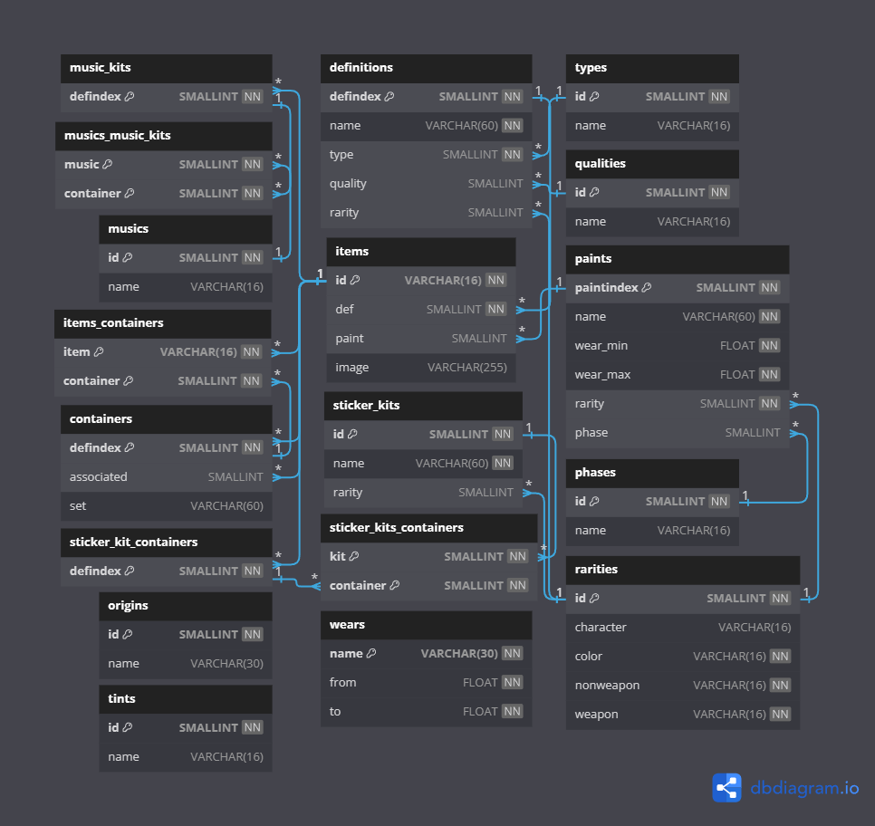

# CS2 Items Schema

This is storage repo of `CS2` (ex. `CSGO`) items schema with attempt to create more understandable format
of `CS2` items and their relations.

> Feel free to use it if you need 😊

> [!IMPORTANT]
> 📦 Contains data extracted from game files only.
> **Does not include all items**

> [!TIP]
> If you are looking for an `itemnameid` of items for [Steam Market](https://steamcommunity.com/market/),
> check out this repo [somespecialone/steam-item-name-ids](https://github.com/somespecialone/steam-item-name-ids)

> [!NOTE]
> This repo is configured to auto-update itself using the GitHub Actions `Schema` workflow.
> You can take a closer look [there](.github/workflows/schema.yml)

## Integrity schema 🧾

Reflects `json` schemas and relationships between entities

## Diagram 📅

Diagram for SQL database

## TODO

- [x] Sticker capsules
- [x] Souvenir packages
- [x] Item sets
- [x] ~~Graffiti with tints~~
- [x] SQL scripts and schema

## Credits

* [csfloat/cs-files](https://github.com/csfloat/cs-files)
* [draw.io](https://draw.io)
* [dbdiagram.io](https://dbdiagram.io/)
