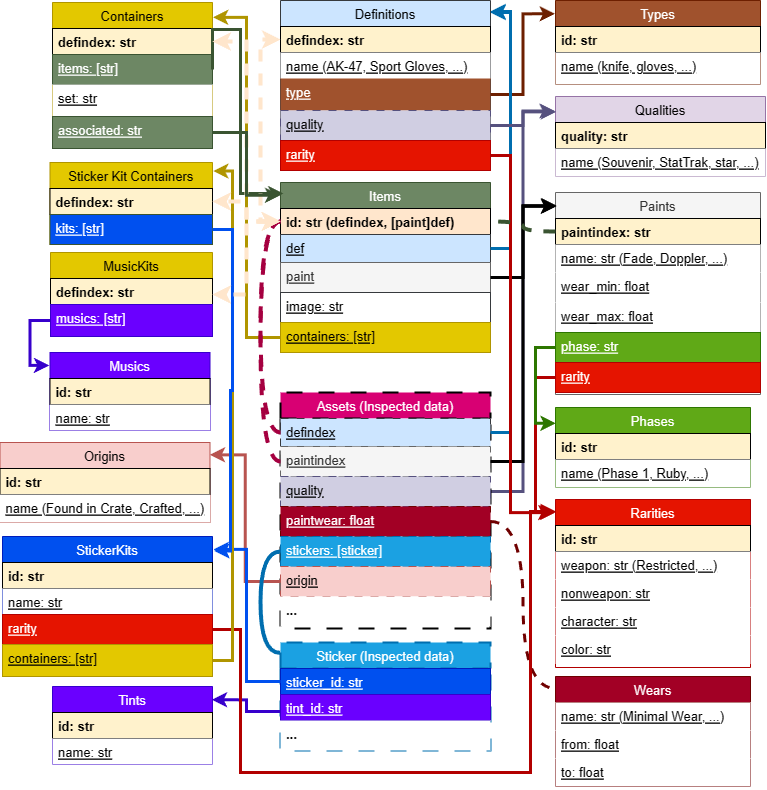

# <p align="center">Csgo items db</p>

[](https://github.com/somespecialone/csgo-items-db/blob/master/LICENSE)
[](https://github.com/psf/black)
[](https://store.steampowered.com/)

This is storage repo of CSGO items schema. Feel free to used it if you need 😊

> Include not all items ⚠, **but almost all tradable items - must be inside** 📦

### Integrity schema 🧾



### Manual usage

To collect data you need `.env` file in project root dir with yours `STEAM_API_KEY` field (need to fetch `GameSchema`
from [api.steampowered.com](https://api.steampowered.com/IEconItems_730/GetSchema/v2/)). Just start `collect.py`
script with one argument - absolute path to `pak01_dir.vpk` file which live in `CSGO/csgo` directory.

> ⚠ For unpacking game resources all `*.vpk` files needed.

Example:

```shell
python ./collect.py "some/absolute/path/Steam/steamapps/common/Counter-Strike Global Offensive/csgo/pak01_dir.vpk"
```

### TODO 📑

- [ ] Rare items in cases (maybe from external resource)
- [ ] Sticker capsules
- [ ] Souvenir packages
- [ ] Item sets
- [x] ~~Graffiti with tints~~
