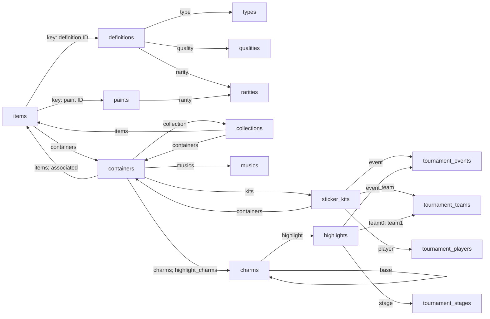
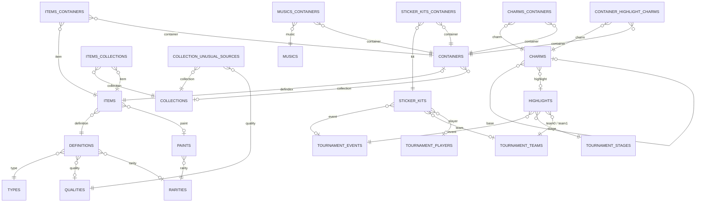

# CS2 Items Schema

This is storage repo of `CS2` items schema with attempt to create more understandable format
of `CS2` items and their relations.

> [!IMPORTANT]
> 📦 Contains data extracted from game files only.
> **Does not include all items**

> [!TIP]
> If you are looking for an `itemnameid/market_bucket_group_id` of items for [Steam Market](https://steamcommunity.com/market/),
> check out this repo [steam-market-ids](https://github.com/somespecialone/steam-market-ids)

> [!NOTE]
> This repo is configured to auto-update itself using the GitHub Actions `Schema` workflow.
> You can take a closer look [there](.github/workflows/schema.yml)

## JSON schema

```mermaid
flowchart LR
    definitions -->|type| types[types]
    definitions -->|quality| qualities[qualities]
    definitions -->|rarity| rarities[rarities]
    paints[paints] -->|rarity| rarities
    items[items] -->|key: definition ID| definitions
    items -->|key: paint ID| paints
    items -->|containers| containers[containers]
    containers -->|items; associated| items
    collections[collections] -->|items| items
    collections -->|containers| containers
    containers -->|collection| collections
    sticker_kits[sticker_kits] -->|containers| containers
    containers -->|kits| sticker_kits
    containers -->|musics| musics[musics]
    containers -->|charms; highlight_charms| charms[charms]
    charms -->|base| charms
    charms -->|highlight| highlights[highlights]
    sticker_kits -->|event| tournament_events[tournament_events]
    highlights -->|event| tournament_events
    sticker_kits -->|team| tournament_teams[tournament_teams]
    highlights -->|team0; team1| tournament_teams
    sticker_kits -->|player| tournament_players[tournament_players]
    highlights -->|stage| tournament_stages[tournament_stages]
```

IDs and foreign references are strings in JSON. Optional fields are omitted when their source values or
localizations are unavailable; an absent flag does not mean `false`.

### Items, definitions, and collections

- An `items` key is either a bare definition ID (`"7"`) or `[paint ID]definition ID` (`"[44]7"`). Thus the
  key itself links painted items to `paints` and `definitions`; `items.containers` links back to containers
  that directly reward the item.
- `definitions.type`, `quality`, and `rarity` are stable source keys in `types`, `qualities`, and `rarities`;
  localized catalog values are display text only. Direct definition quality/rarity takes precedence over inherited
  values. When quality is absent, inherited `craft_class = "unusual"` maps to quality `"unusual"` (`★`); this
  is not inferred for every knife or glove.
- `definitions.tradable` is emitted as `false` only when the definition or an inherited prefab explicitly sets
  `cannot trade = 1`. Absence does not prove that an item is tradable or marketable.
- `paints.rarity` is a source key in `rarities`. Definition and paint rarity remain separate; no final per-item rarity is inferred.
- A `collections` key is the source item-set ID. Its `items` are item IDs and its `containers` are container
  IDs; `containers.collection` provides the inverse link. Collections without a container omit `containers`.
- In `collections.unusuals`, each key is a source quality key from `qualities`; each value is an unresolved
  source loot-list name, not an entity ID, enumerated reward list, or probability.

### Containers and sticker kits

All containers share `containers.json`. `kind` distinguishes `weapon_case`, `souvenir_package`,
`sticker_capsule`, `patch_capsule`, `graffiti_container`, `music_kit_container`, `charm_container`, and `coupon`.
`container` is used when the source establishes a container but not a more specific supported kind.

Container fields:

| Field                   | Meaning                                                                           |
| ----------------------- | --------------------------------------------------------------------------------- |
| `collection`            | Collection ID in `collections`; inverse of `collections.containers`               |
| `associated`            | Item ID in `items`, such as the key associated with a case                        |
| `items`                 | Item IDs in `items`; a reward may itself identify another container               |
| `kits`                  | Kit IDs in `sticker_kits`                                                         |
| `musics`                | Music kit IDs in `musics`                                                         |
| `charms`                | Direct reward IDs in `charms`                                                     |
| `highlight_charms`      | Charm IDs selected by explicit highlight-reward metadata                          |
| `will_produce_stattrak` | Explicit item/root-loot-list flag; not inferred from names or conditional rewards |

A coupon remains `kind = "coupon"` even when it awards a music kit or another container.
Container-awarding coupons link to that item; the awarded container's contents are not flattened into the coupon.
Known containers with unresolved contents retain their metadata without fabricated reward lists.

`sticker_kits.kind` distinguishes `sticker`, `patch`, and `graffiti`. Its `rarity` points to `rarities`;
`containers` points to rewarding containers; `event`, `team`, and `player` point to the corresponding
tournament catalogs. `items.kits`, `items.musics`, and `items.charms` expose direct container rewards.

### Charms, highlights, and tournaments

- `charms.rarity` and `quality` are source keys in `rarities` and `qualities`.
- `charms.base` is another charm ID: the parent/template of a variant. The variant omits the parent's duplicate
  description and inherits missing rarity and quality from it.
- `charms.highlight` is an ID in `highlights` for the play represented by that charm.
- `highlights.event`, `stage`, `team0`, and `team1` point to the corresponding tournament catalogs; `map` and
  source `key` are plain metadata. No player identity is inferred from the key.
- `tournament_events` supplies optional `name` and `short_name`; `tournament_stages` maps each stage ID directly
  to its localized name. `tournament_teams` and `tournament_players` supply optional identity metadata.
  Referenced IDs without lookup metadata remain present, including team ID `0`; raw `geo` values such as
  `WORLD` are not necessarily country codes.

## SQL schema

```mermaid
erDiagram
    DEFINITIONS }o--|| TYPES : type
    DEFINITIONS }o--o| QUALITIES : quality
    DEFINITIONS }o--o| RARITIES : rarity
    PAINTS }o--|| RARITIES : rarity
    ITEMS }o--|| DEFINITIONS : definition
    ITEMS }o--o| PAINTS : paint
    CONTAINERS o|--|| ITEMS : defindex
    ITEMS_COLLECTIONS }o--|| COLLECTIONS : collection
    ITEMS_COLLECTIONS }o--|| ITEMS : item
    CONTAINERS }o--o| COLLECTIONS : collection
    COLLECTION_UNUSUAL_SOURCES }o--|| COLLECTIONS : collection
    COLLECTION_UNUSUAL_SOURCES }o--|| QUALITIES : quality
    ITEMS_CONTAINERS }o--|| ITEMS : item
    ITEMS_CONTAINERS }o--|| CONTAINERS : container
    STICKER_KITS_CONTAINERS }o--|| STICKER_KITS : kit
    STICKER_KITS_CONTAINERS }o--|| CONTAINERS : container
    MUSICS_CONTAINERS }o--|| MUSICS : music
    MUSICS_CONTAINERS }o--|| CONTAINERS : container
    CHARMS_CONTAINERS }o--|| CHARMS : charm
    CHARMS_CONTAINERS }o--|| CONTAINERS : container
    CONTAINER_HIGHLIGHT_CHARMS }o--|| CHARMS : charm
    CONTAINER_HIGHLIGHT_CHARMS }o--|| CONTAINERS : container
    CHARMS }o--o| CHARMS : base
    CHARMS }o--o| HIGHLIGHTS : highlight
    HIGHLIGHTS }o--|| TOURNAMENT_EVENTS : event
    HIGHLIGHTS }o--|| TOURNAMENT_STAGES : stage
    HIGHLIGHTS }o--|| TOURNAMENT_TEAMS : "team0 / team1"
    STICKER_KITS }o--o| TOURNAMENT_EVENTS : event
    STICKER_KITS }o--o| TOURNAMENT_TEAMS : team
    STICKER_KITS }o--o| TOURNAMENT_PLAYERS : player
```

## TODO

- [x] Sticker capsules
- [x] Souvenir packages
- [x] Item sets
- [x] ~~Graffiti with tints~~
- [x] SQL scripts and schema

## Credits

- [SteamTracking/GameTracking-CS2](https://github.com/SteamTracking/GameTracking-CS2)
