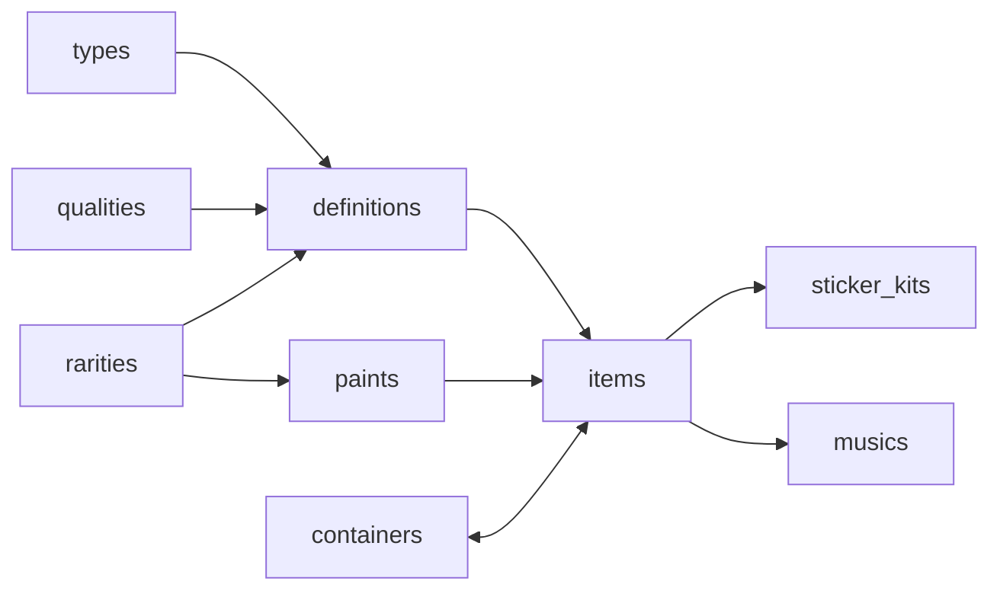
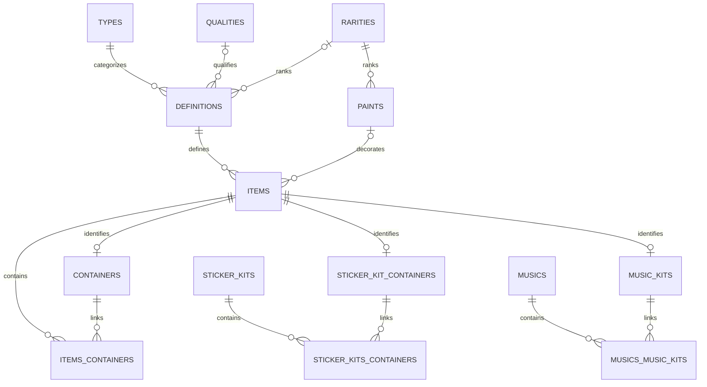

# CS2 Items Schema

This is storage repo of `CS2` (ex. `CSGO`) items schema with attempt to create more understandable format
of `CS2` items and their relations.

> [!IMPORTANT]
> 📦 Contains data extracted from game files only.
> **Does not include all items**

> [!TIP]
> If you are looking for an `itemnameid/market_bucket_group_id` of items for [Steam Market](https://steamcommunity.com/market/),
> check out this repo [steam-market-ids](https://github.com/somespecialone/steam-market-ids)

> [!NOTE]
> This repo is configured to auto-update itself using the GitHub Actions `Schema` workflow.
> You can take a closer look [there](.github/workflows/schema.yml)

## JSON schema

```mermaid
flowchart LR
    types[types] --> definitions[definitions]
    qualities[qualities] --> definitions
    rarities[rarities] --> definitions
    rarities --> paints[paints]
    definitions --> items[items]
    paints --> items
    containers[containers] <--> items
    items --> sticker_kits[sticker_kits]
    items --> musics[musics]
```

## SQL schema

```mermaid
erDiagram
    TYPES ||--o{ DEFINITIONS : categorizes
    QUALITIES o|--o{ DEFINITIONS : qualifies
    RARITIES o|--o{ DEFINITIONS : ranks
    RARITIES ||--o{ PAINTS : ranks
    DEFINITIONS ||--o{ ITEMS : defines
    PAINTS o|--o{ ITEMS : decorates
    ITEMS ||--o| CONTAINERS : identifies
    ITEMS ||--o| STICKER_KIT_CONTAINERS : identifies
    ITEMS ||--o| MUSIC_KITS : identifies
    ITEMS ||--o{ ITEMS_CONTAINERS : contains
    CONTAINERS ||--o{ ITEMS_CONTAINERS : links
    STICKER_KITS ||--o{ STICKER_KITS_CONTAINERS : contains
    STICKER_KIT_CONTAINERS ||--o{ STICKER_KITS_CONTAINERS : links
    MUSICS ||--o{ MUSICS_MUSIC_KITS : contains
    MUSIC_KITS ||--o{ MUSICS_MUSIC_KITS : links
```

## TODO

- [x] Sticker capsules
- [x] Souvenir packages
- [x] Item sets
- [x] ~~Graffiti with tints~~
- [x] SQL scripts and schema

## Credits

- [SteamTracking/GameTracking-CS2](https://github.com/SteamTracking/GameTracking-CS2)
