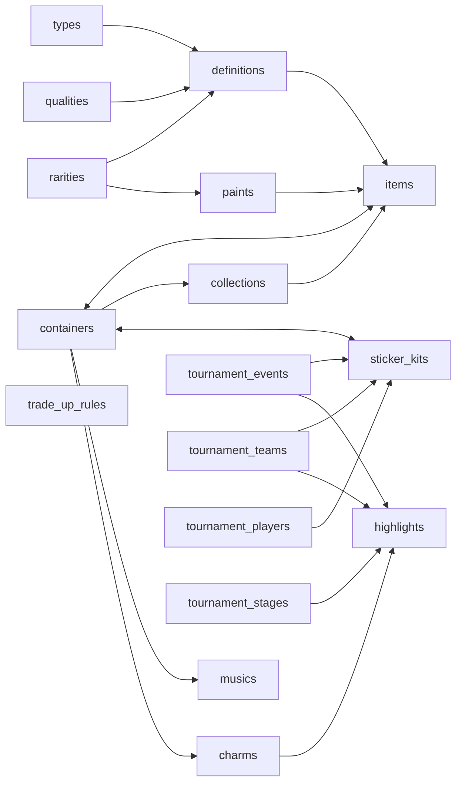
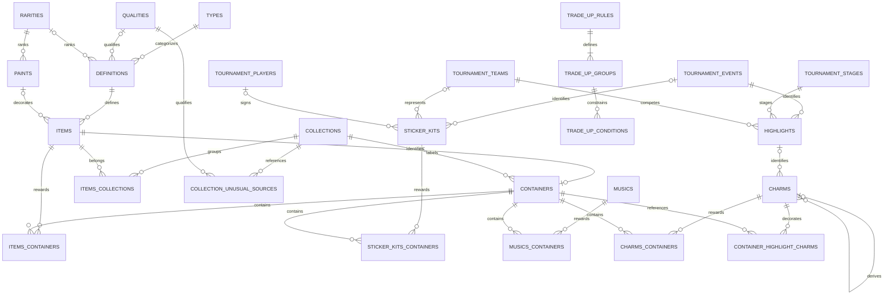

# CS2 Items Schema

This is storage repo of `CS2` (ex. `CSGO`) items schema with attempt to create more understandable format
of `CS2` items and their relations.

> [!IMPORTANT]
> 📦 Contains data extracted from game files only.
> **Does not include all items**

> [!TIP]
> If you are looking for an `itemnameid/market_bucket_group_id` of items for [Steam Market](https://steamcommunity.com/market/),
> check out this repo [steam-market-ids](https://github.com/somespecialone/steam-market-ids)

> [!NOTE]
> This repo is configured to auto-update itself using the GitHub Actions `Schema` workflow.
> You can take a closer look [there](.github/workflows/schema.yml)

## JSON schema

```mermaid
flowchart LR
    types[types] --> definitions[definitions]
    qualities[qualities] --> definitions
    rarities[rarities] --> definitions
    rarities --> paints[paints]
    definitions --> items[items]
    paints --> items
    containers[containers] <--> items
    collections[collections] --> items
    containers --> collections
    containers <--> sticker_kits[sticker_kits]
    containers --> musics[musics]
    containers --> charms[charms]
    charms --> highlights[highlights]
    tournament_events[tournament_events] --> sticker_kits
    tournament_events --> highlights
    tournament_teams[tournament_teams] --> sticker_kits
    tournament_teams --> highlights
    tournament_players[tournament_players] --> sticker_kits
    tournament_stages[tournament_stages] --> highlights
    trade_up_rules[trade_up_rules]
```

IDs and foreign references are strings in JSON. Optional fields are omitted when their source values or
localizations are unavailable; an absent flag does not mean `false`.

### Definitions and collections

- `definitions` resolves inherited `quality` and `rarity`, with direct item fields taking precedence.
  When direct quality is absent, `craft_class = "unusual"` assigns quality `"3"` (`★`) before ordinary
  inherited quality is considered. Default knives/gloves are not assigned `★`.
- Definition rarity and paint rarity remain separate; no final per-inventory-item rarity is inferred.
- `collections` is keyed by the source item-set identifier. Each record contains normalized `items`,
  an optional localized `name`, and an optional `hidden` flag. Both painted items and bare agent definitions
  retain their membership, independently of whether an item image is indexed.
- Optional collection `unusuals` maps source quality IDs to unresolved loot-list names. These preserve
  source references, not enumerated rare rewards or drop probabilities.

### Containers and sticker kits

All containers share `containers.json`. `kind` distinguishes `weapon_case`, `souvenir_package`,
`sticker_capsule`, `patch_capsule`, `graffiti_container`, `music_kit_container`, `charm_container`, and `coupon`.
`container` is used when the source establishes a container but not a more specific supported kind.

Container fields:

| Field                   | Meaning                                                                           |
| ----------------------- | --------------------------------------------------------------------------------- |
| `collection`            | Source collection identifier                                                      |
| `associated`            | Explicit associated item, such as a case key                                      |
| `items`                 | Direct bare or painted item rewards; a reward can itself be another container     |
| `kits`                  | Sticker, patch, or graffiti kit IDs                                               |
| `musics`                | Music kit IDs                                                                     |
| `charms`                | Direct charm reward IDs                                                           |
| `highlight_charms`      | Charm IDs specified by `match_highlight_reel_keychain` reward metadata            |
| `will_produce_stattrak` | Explicit item/root-loot-list flag; not inferred from names or conditional rewards |

A coupon remains `kind = "coupon"` even when it awards a music kit or another container.
Container-awarding coupons link to that item; the awarded container's contents are not flattened into the coupon.
Known containers with unresolved contents retain their metadata without fabricated reward lists.

`sticker_kits` retains `kind` (`sticker`, `patch`, or `graffiti`) alongside optional `name`, `rarity`,
`containers`, and source tournament references `event`, `team`, and `player`.
Existing `items.kits` and `items.musics` links remain available; direct charm rewards also appear as `items.charms`.

### Charms, highlights, and tournaments

- `charms` is keyed by numeric source charm ID, with source `key`, optional localized `name`/`description`,
  `rarity`, `quality`, and numeric `base`/`highlight` references. Variants inherit description, rarity, and
  quality from their explicitly named base when absent locally.
- `highlights` preserves each numeric reel ID and source `key`, with `event`, `stage`, `map`, `team0`, and `team1`.
  No player identity is inferred from the reel key.
- `tournament_events` supplies optional `name` and `short_name`; `tournament_stages` supplies optional `name`.
- `tournament_teams` supplies optional `tag` and `geo`; `tournament_players` supplies optional `name` and `geo`.
  `geo` is the source geographic tag, which can be `WORLD`, not necessarily a country code.
- Explicitly referenced IDs without lookup metadata remain identity-only records, including source team ID `0`.
  Missing team names are not guessed from sticker text.

### Trade-up rules

`trade_up_rules` preserves source recipe IDs, optional resolved names, and the flags `disabled`,
`all_same_class`, and `premium_only`. `inputs` contains groups with an integer `count`;
`outputs` contains groups with their source `key`. Both contain ordered `conditions` with
`field`, `operator`, `value`, and boolean `required`.

Condition expressions are preserved verbatim, including values such as `unique,tournament` and fields
such as `*match_set_rarity`. This is a source-rule catalog, not an eligibility evaluator or odds calculator.
It does not infer actual item origin, current inventory restrictions, or complete server-side behavior.

## SQL schema

```mermaid
erDiagram
    TYPES ||--o{ DEFINITIONS : categorizes
    QUALITIES o|--o{ DEFINITIONS : qualifies
    RARITIES o|--o{ DEFINITIONS : ranks
    RARITIES ||--o{ PAINTS : ranks
    DEFINITIONS ||--o{ ITEMS : defines
    PAINTS o|--o{ ITEMS : decorates
    ITEMS ||--o| CONTAINERS : identifies
    COLLECTIONS ||--o{ ITEMS_COLLECTIONS : groups
    ITEMS ||--o{ ITEMS_COLLECTIONS : belongs
    COLLECTIONS ||--o{ CONTAINERS : labels
    COLLECTIONS ||--o{ COLLECTION_UNUSUAL_SOURCES : references
    QUALITIES ||--o{ COLLECTION_UNUSUAL_SOURCES : qualifies
    ITEMS ||--o{ ITEMS_CONTAINERS : rewards
    CONTAINERS ||--o{ ITEMS_CONTAINERS : contains
    STICKER_KITS ||--o{ STICKER_KITS_CONTAINERS : rewards
    CONTAINERS ||--o{ STICKER_KITS_CONTAINERS : contains
    MUSICS ||--o{ MUSICS_CONTAINERS : rewards
    CONTAINERS ||--o{ MUSICS_CONTAINERS : contains
    CHARMS ||--o{ CHARMS_CONTAINERS : rewards
    CONTAINERS ||--o{ CHARMS_CONTAINERS : contains
    CHARMS ||--o{ CONTAINER_HIGHLIGHT_CHARMS : decorates
    CONTAINERS ||--o{ CONTAINER_HIGHLIGHT_CHARMS : references
    CHARMS o|--o{ CHARMS : derives
    HIGHLIGHTS o|--o{ CHARMS : identifies
    TOURNAMENT_EVENTS ||--o{ HIGHLIGHTS : identifies
    TOURNAMENT_STAGES ||--o{ HIGHLIGHTS : stages
    TOURNAMENT_TEAMS ||--o{ HIGHLIGHTS : competes
    TOURNAMENT_EVENTS o|--o{ STICKER_KITS : identifies
    TOURNAMENT_TEAMS o|--o{ STICKER_KITS : represents
    TOURNAMENT_PLAYERS o|--o{ STICKER_KITS : signs
    TRADE_UP_RULES ||--|{ TRADE_UP_GROUPS : defines
    TRADE_UP_GROUPS ||--o{ TRADE_UP_CONDITIONS : constrains
```

## TODO

- [x] Sticker capsules
- [x] Souvenir packages
- [x] Item sets
- [x] ~~Graffiti with tints~~
- [x] SQL scripts and schema

## Credits

- [SteamTracking/GameTracking-CS2](https://github.com/SteamTracking/GameTracking-CS2)
